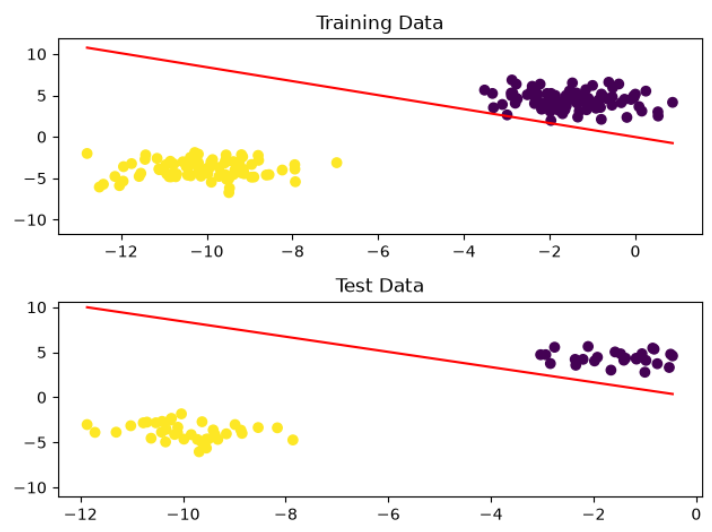
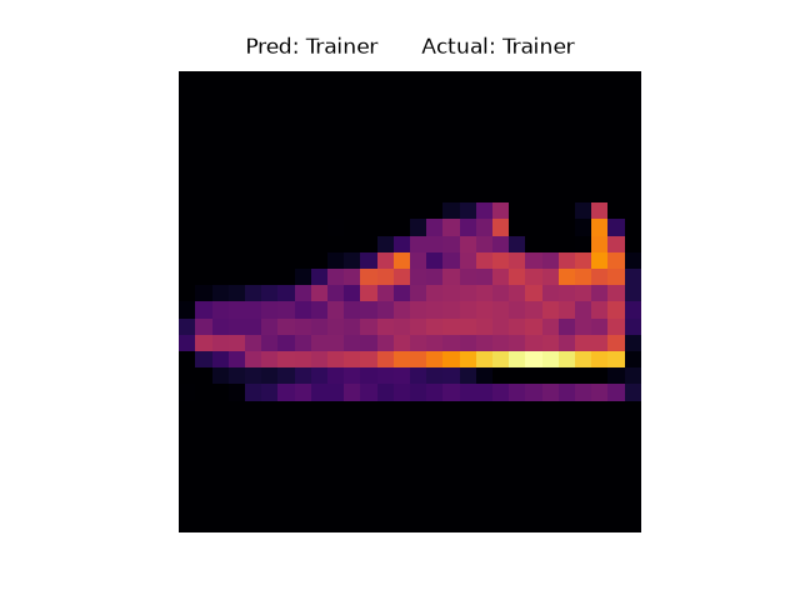
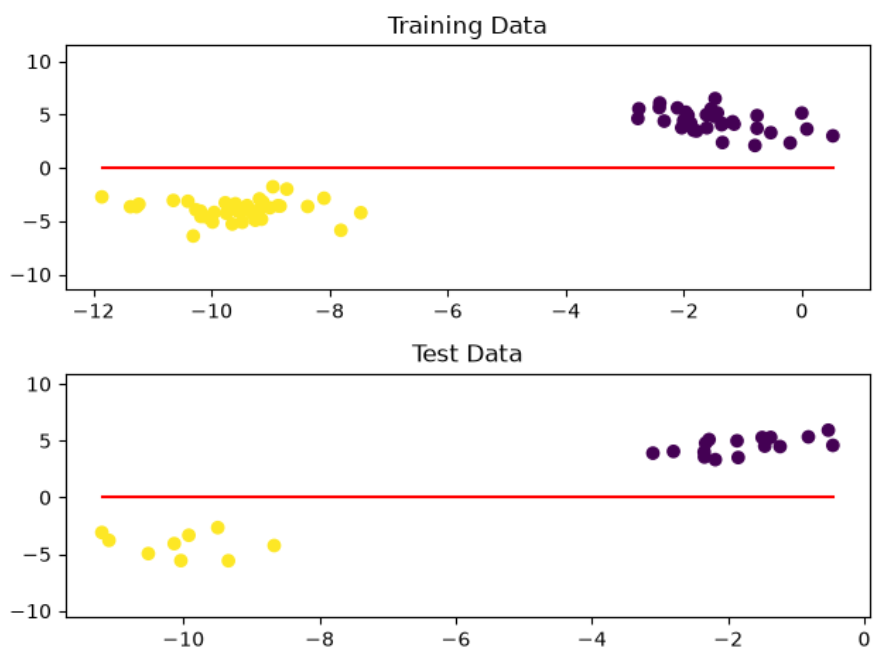
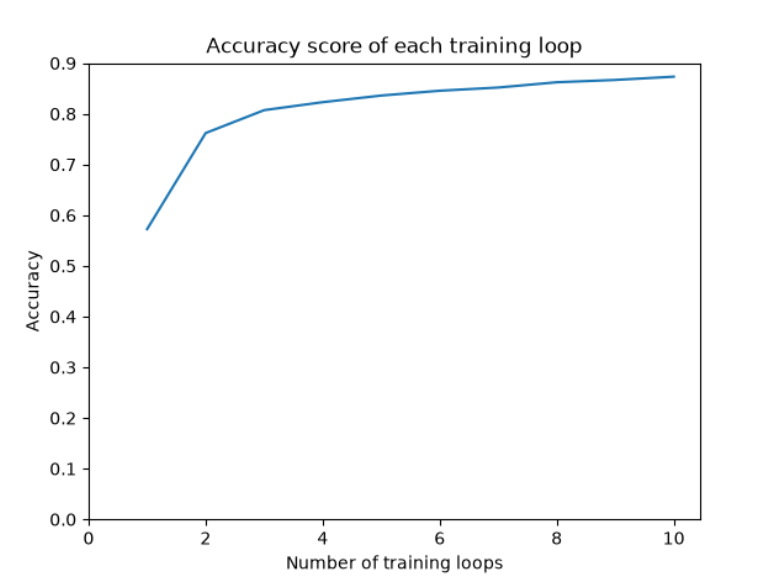
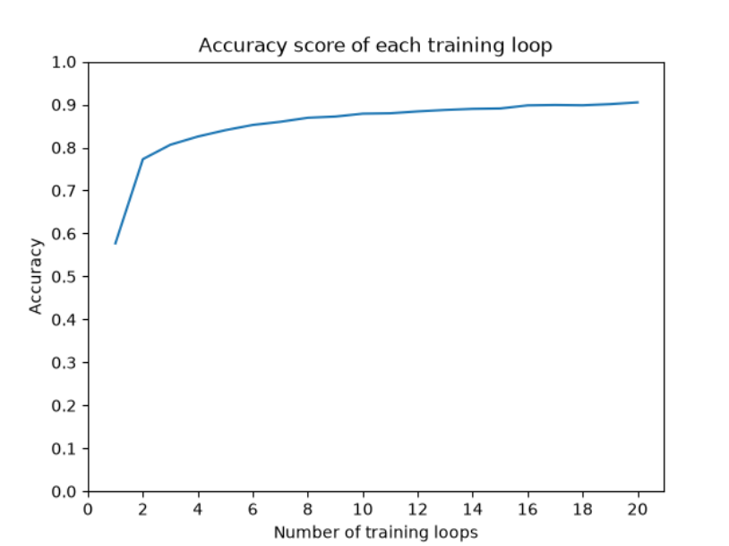
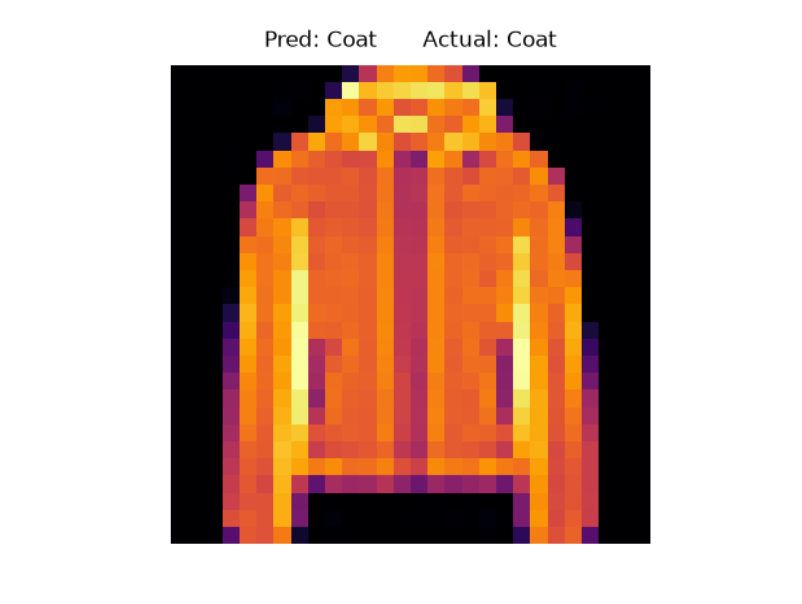
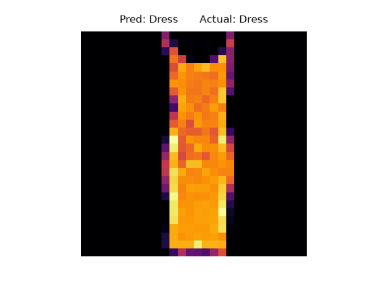

# Neural Network From Scratch

---
| Single-Layer Perceptron                | Multi-Layer Perceptron            |
|:---------------------------------------|:----------------------------------|
|  |  |

## Why we chose to make an SL and ML Perceptron
We both had limited previous experience in Python so we decided to create and develop a single and multi-layer 
perceptron.
This would allow us to push our boundaries as well as build upon knowledge that we had gained in 
our Artificial Intelligence module where we were introduced to the concept of machine learning and its origins.


## Single-Layer to Multi-Layer

A single-layer perceptron was what we attempted first as this would be able to provide the fundamentals of the
perceptron such as weights and biases. This gave us a better understanding of how the learning process worked and how 
this could be applied to a multi-layer network where additional layers are used to abstract and learn more complex 
relationships between data

The multi-layer perceptron did create more challenges as we had to adapt weights and biases so that they were
suitable to be passed through multiple layers. This required more understanding of the equations that perceptrons use
to learn and added complexity through the addition of forward and backpropagation and error correction.

---

This Python project explores the fundamentals of neural networks by implementing them from scratch using NumPy.

The project progresses from a basic single-layer perceptron into a multi-layer perceptron capable of classifying images 
from the Fashion-MNIST dataset.

---

## The Single-Layer Perceptron

The first stage implements a single-layer perceptron designed to classify linearly separable data.

### Development
There were challenges through development, particularly when we had to translate the required equations into code 
and determine how this could be represented through variables and functionality. We also learned how to plot the 
results, which improved our understanding of how loops and weights affected the accuracy of its 
predictions. 

Ultimately we were able to create a successful perceptron that could train its weights and biases 
based on the training data and labels. With each iteration the perceptron went over the data input and using comparisons 
with the expected output, would adjust the variables accordingly to improve its predictions.

### Example

This is an image of the single-layer perceptron separating two blobs of data (100 samples).
As the line between shows, the perceptron was able to correctly split the two groups both within training and testing
data.

### Features

- Weight and bias updates
- Binary threshold activation
- Perceptron learning algorithm
- Training and testing data
- Accuracy calculation
- Plotting of the decision boundary

The model is trained on generated data, with the learned decision boundary plotted to demonstrate how the perceptron
separates the two classes.

---

## The Multi-Layer Perceptron

The network is trained to classify images from Fashion-MNIST, which contains 10 different categories of clothing.

### Development
The multi-layer perceptron proved to be more challenging than the single layer due to 
the addition of hidden layers. Our knowledge of using weights and biases was transferable from what we had 
done for the single-layer perceptron. However, working through the additional layers required us to use new functions 
such as ReLu and softmax, which added another level of difficulty to development.

The introduction of forward pass and backpropagation also created more considerations as we had to train the perceptron 
to adjust its weights and biases based on the calculated error throughout the layers. Breaking down the 
equation and their differentials allowed us to gain a better understanding of how to approach and implement these 
methods.

---

We were able to complete the multi-layer perceptron so that it could correctly identify the labels of different clothing
images. This was displayed with a graph showing the accuracy for each training loop, with the trend allowing us to see 
how the model improved during training. In addition, random images were selected to test the perceptron's ability 
to predict clothing names.

### Features

- Multiple hidden layers
- ReLU activation
- Softmax + Cross-entropy learning method
- One-hot encoded labels
- Forward propagation
- Backpropagation
- Gradient-based weight and bias updates
- Fashion-MNIST image classification
- Training accuracy visualisation

---
### Screenshots
| 10 Layer Accuracy Graph                        | 20 Layer Accuracy Graph                        |
|:-----------------------------------------------|:-----------------------------------------------|
|  |  |


These graphs show the accuracy achieved with 10 and 20 training loops with each loop's corresponding accuracy score.
The results show that increasing from 10 to 20 training loops resulted in a higher resulting accuracy.


| Coat Image Recognition         | Dress Image Recognition         |
|:-------------------------------|:--------------------------------|
|  |  |

These are randomly selected images taken from the dataset that are used to test the perceptron's predictions.
As shown above, the perceptron correctly identified the labels for these images.
---

## Libraries used

- Python
- NumPy
- Matplotlib
- sklearn

---

## What we have learnt

- Fundamentals of machine learning
- Basics of neural network architecture
- Use of weights and biases
- NumPy applications
- Graph plotting
- Forward propagation
- Backpropagation
- Calculating and evaluating accuracy
- Image classification (Fashion-MNIST)

---

## Future Improvements

- Adapt the multi-layer perceptron to identify more complex images
- Experiment with different activation functions
- Use external images with the trained model to test its predictions
- Test the impact of input size, number of training loops and weights on overall accuracy and processing time
- Applying this knowledge into developing a Convolutional Neural Network(CNN)

---

## Installation
Install the external libraries required using:

```bash
pip install numpy scikit-learn matplotlib